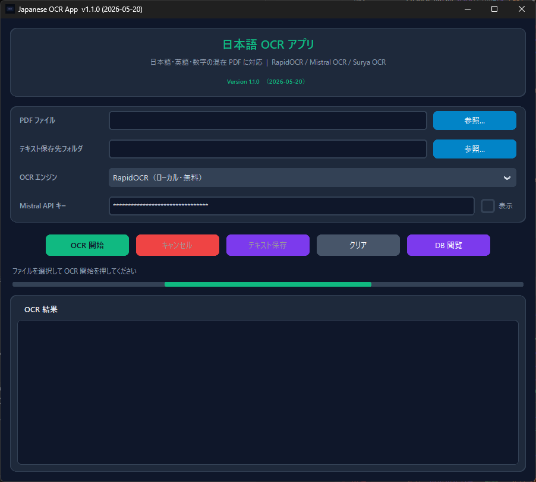
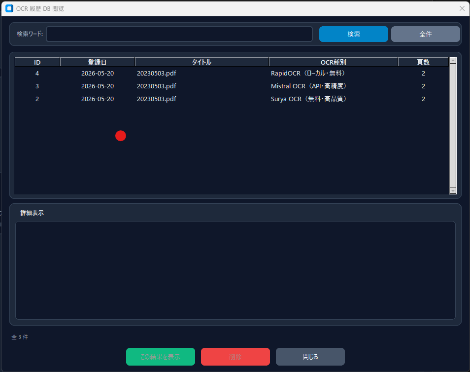

# Japanese OCR App

日本語・英語・数字の混在PDFに対応したOCRアプリです。  
RapidOCR、Mistral OCR、Surya OCR を切り替えて利用できます。

## 実行画面

### メイン画面

### DB履歴画面

## 主な機能

- PDFファイルのOCR処理
- RapidOCR / Mistral OCR / Surya OCR の切り替え
- PDF内テキスト層の抽出
- OCR結果のテキスト保存 / クリップボードへのコピー
- SQLiteによるOCR履歴保存
- DB履歴画面での検索、閲覧、削除
- 中国簡体字が混入したOCR結果の日本語漢字への正規化
- 左右スライドで幅を調整できる2カラムUIレイアウト

## セットアップ

1. Python 3.9以上をインストールします。
2. `setup.bat` を実行します。
3. セットアップ完了後、`run.bat` でアプリを起動します。

初回はOCRモデルのダウンロードが行われるため、時間がかかる場合があります。

## 使い方

1. `run.bat` を実行します。
2. 左サイドバーの「参照...」からPDFファイルを選択します。
3. OCRエンジンを選択します。
4. Mistral OCRを使う場合はAPIキーを入力します。
5. 「▶ OCR 開始」ボタンを押します。
6. 右エリアに結果が表示されます。「📋 コピー」でクリップボードにコピーできます。
7. 必要に応じて「テキスト保存」またはヘッダーの「DB 閲覧」を利用します。

> **Tip:** 左右の境界をドラッグするとサイドバーの幅を自由に調整できます。  
> パスが長い場合はサイドバーを広げると全体が見えます。

## OCRエンジン

### RapidOCR

ローカルで処理する無料のOCRエンジンです。PDF内にテキスト層がある場合は、画像OCRより先にテキスト層を抽出します。

### Mistral OCR

Mistral APIを使う高精度OCRです。利用にはMistral APIキーが必要です。

### Surya OCR

ローカルで処理する高品質OCRエンジンです。レイアウト検出により、表をMarkdown形式で出力できます。

## 詳細

詳しい説明は [README.txt](README.txt) を参照してください。
